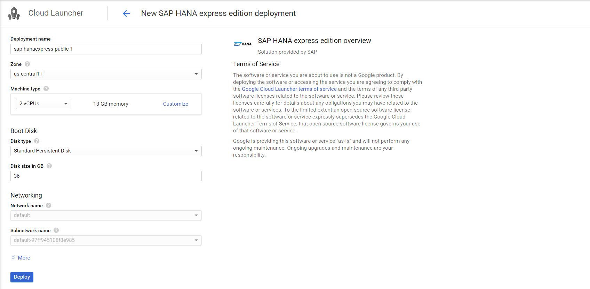

## Prerequisites  
 - You have a Google Account and/or have registered for the free trial on `cloud.google.com`

## Next Steps
- [Prepare SAP HANA, express edition for the SAP HANA Tutorial Catalog](http://www.sap.com/developer/how-tos/2016/09/hxe-howto-tutorialprep.html)
- [Review SAP HANA, express edition content, tutorials and quick start guides](http://www.sap.com/developer/topics/sap-hana-express.html)
- [**OPTIONAL** - Setup PuTTY and WinSCP to access your SAP HANA, express edition instance on Google Cloud Platform](http://www.sap.com/developer/tutorials/hxe-gcp-setup-putty-winscp-windows.html)  

## Details
### You will learn  
 - How to create a new Google Cloud Platform virtuan instance based on SAP HANA, express edition
 - How to set your new instance, and enable it for tutorials and developing your first applicaiton

### Time to Complete
**15 Min**

---

[ACCORDION-BEGIN [Step 1: ](Launch SAP HANA, express edition from the Google Cloud Platform Launcher)]

Navigate to [Google Cloud Launcher](https://console.cloud.google.com/launcher), and search for SAP HANA, express edition.

1.  Click on the **`Launch on Compute Engine`** button.    The next page will allow you to modify the default configuration for the Cloud Virtual Machine.

2.  Type an identifying name for the instance, then select the desired geographic zone and machine type. Individual zones might have differing computing resources available and specific access restrictions.

3.  The default settings for RAM, CPU and Storage is appropriate for getting familiar with SAP HANA.

4.  By default, the firewall rules are configured specifically for SAP HANA, express edition.  As new SAP HANA XSA based applications are created, additional ports might have to be opened up.

5.  After reviewing all configuration options, click **"Deploy"**

6.  Use the web based SSH tool and log into instance, and type `sudo su - hxeadm`.   Follow the prompts to change passwords

[DONE]
[ACCORDION-END]

[ACCORDION-BEGIN [Step 2: ](Generate Key pairs to connect to your VM instance)]

To connect to your newly deployed instance via SSH, review the documentation at https://cloud.google.com/compute/docs/instances/connecting-to-instance

[DONE]
[ACCORDION-END]

[ACCORDION-BEGIN [Step 3: ](Prepare your instance for SAP HANA, express edition tutorials)]

Your SAP HANA, express edition instance is now up and running.  Proceed to the "Next Steps" section, and set up your SAP HANA, express edition

[DONE]
[ACCORDION-END]

## Optional
- [Setup Putty and WinSCP in your Windows PC](http://www.sap.com/developer/tutorials/hxe-gcp-setup-putty-winscp-windows.html)

## Next Steps
- [Prepare SAP HANA, express edition for the SAP HANA Tutorial Catalog](http://www.sap.com/developer/how-tos/2016/09/hxe-howto-tutorialprep.html)
- [Review SAP HANA, express edition content, tutorials and quick start guides](sap.com/developer/topics/sap-hana-express.html)

